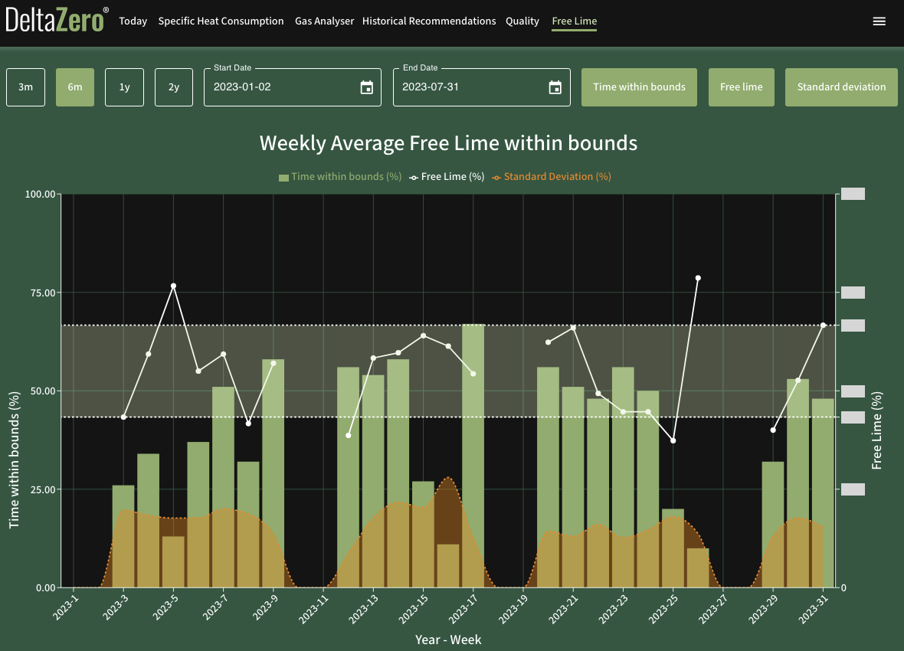

# Free Lime

The **Weekly Average Free Lime within bounds** data report demonstrates the amount of time an acceptable amount of residual lime has remained in the clinker.

## Data Views

Change the data view of this report by selecting at least one of the following options:

- Time within bounds (in green, left y-axis) represents the percentage (%) of time where the amount of free lime in the clinker production remained within bounds (acceptable targets) in a given week. 

- Free lime (in white, right y-axis) represents the weekly average percentage (%) of free lime present in the clinker.

    - The opaque envelope represents the bounds. To change the upper and lower bounds, contact us at {{ support }}.

- Standard deviation (in orange) represents the standard deviation of the free lime (%) for that week. 

## Date Range

Change the date range of this report by selecting the calendar icon in **Start Date** and **End Date** (both dates inclusive).

Alternatively, select the corresponding button to apply the desired time period of the data (inclusive of today):

- **3m** – Past 3 months
- **6m** – Past 6 months (default)
- **1y** – Past 1 year
- **2y** – Past 2 years

## Data Export

There is no export feature on this page. You may contact us at {{ support }} to request a copy of this data.