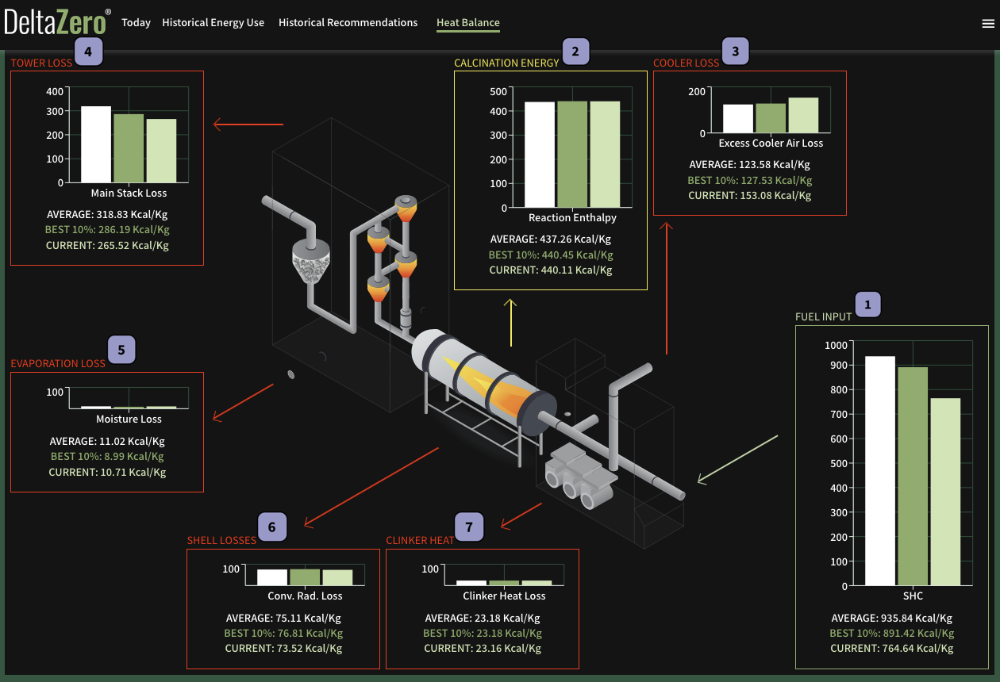

The **Heat Balance** data report is a visualisation of your plant’s energy (fuel) input & output from the baseline period, excluding data from non-stable periods (such as plant startups and shutdowns).

All charts are measured in kcal/kg, displaying the following:

- **Average** of fuel input or output over the baseline period.
- **Best 10%** or average of the lowest 10% input/output over the baseline period.
- **Current** live plant data.

Charts in green are for energy input, yellow for calcination, and red for energy loss.

!!! example "Coming soon..."
    These calculations are currently manually written into this report. Real-time dynamic values will be coming soon!

## Energy Flow

### Fuel Input

**Fuel input** or Specific Heat Consumption (SHC) of the fuel used to heat the kiln.

### Calcination Energy

**Calcination energy** (reaction enthalpy) used to heat the kiln. Historical data for Reaction Enthalpy is detailed at the bottom of the page.

### Cooler Loss

**Cooler loss** (excess cooler air loss) of energy in the form of excess hot (aspiration) air leaving the clinker cooler stack.

### Tower Loss

**Tower loss** (main stack loss) of energy in the form of hot air leaving the gas exit of the preheating tower.

### Evaporation Loss

**Evaporation loss** (moisure loss) in the feed, fuel, and combustion products.

### Shell Losses

**Shell losses** (cnvection &amp; radiation loss) of energy in the form of heat from convection and radiation in the kiln shell.

### Clinker Heat

**Clinker heat** loss of energy in the form of heat above the ambient temperature.

## Reaction Enthalpy

The **reaction enthalpy** data report shows all historical data points for [calcination energy](#calcination-energy).

The white horizontal line indicates the current calcination energy.

## Data Export

There is no export feature on this page. You may contact us at {{ support }} to request a copy of this data.
