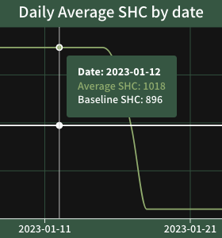

The **Average SHC** is calculated on a per-day (24-hour period based on your local timezone) or 7-day basis over the selected time period. 

Hover over the chart to see the data points.

{ .img-smaller }

The white horizontal line indicates the **Baseline SHC** or average performance for the selected time period. 

If the Average SHC (in green) is above the Baseline SHC (white), your emissions on that day were higher than the average observed in the selected time period.