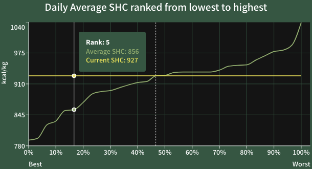

This chart orders & ranks all the daily **Average SHC** in the selected time period: From the lowest daily average emissions (Best, 0%, Rank no. 1) to highest emissions (Worst, 100%)..

The yellow horizontal line indicates the **Current SHC** (current average emissions), and the dotted vertical line indicates its rank. 

The bottom-left quadrant of the chart (below the Current SHC, and left to the rank of the Average SHC) is the optimal range where emissions have been the lowest in the selected time period.

!!! example
    In the screenshot above, the current SHC is 927 kcal/kg (yellow horizontal line): Ranked no. 14 out of 30, approximately in the 47th percentile of average emissions (dashed vertical line). 
    
    This means the current SHC is lower than approximately 53% of average emissions during that time period, the no. 5 best of which was an average of 856 kcal/kg (green line).

To check the plant parameters set that day, refer to the [Daily Average SHC](heu_average_shc_date.md) by date chart on the left to get the date of the Average SHC, then use this to filter the [Historical Recommendations](historical_recommendations.md) by time.
