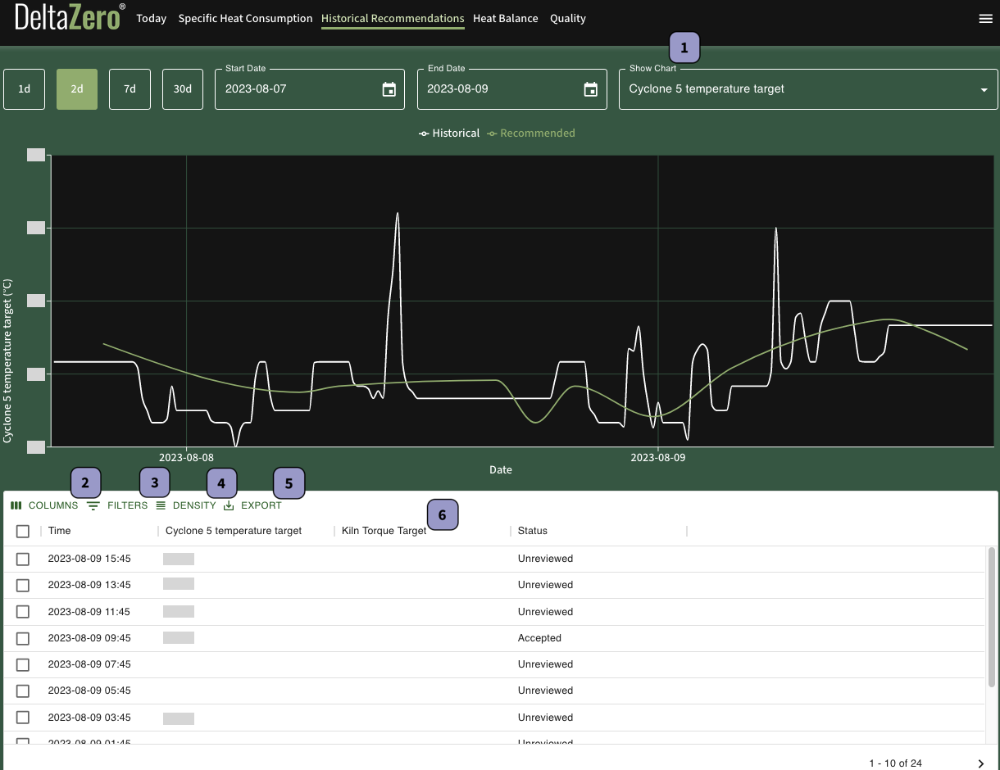

The **Historical Recommendations** data report compares historical values of recommendable metrics (in white) and their recommended change (green). 

## Date Range

Change the date range of this report by selecting the calendar icon in **Start Date** and **End Date** (both dates inclusive).

Alternatively, select the corresponding button to apply the desired time period of the data (inclusive of today):

- **1d** – Past 1 day
- **2d** – Past 2 days (default)
- **7d** – Past 7 days
- **30d** – Past 30 days

## Data Table

The data table contains details of each recommendation, including the Status or outcome of the recommendation.

{{ label_1 }} **Show Chart**: Updates chart with data for the selected recommendable metric

{{ label_2 }} **Columns**: Show or hide selected columns in the data table

{{ label_3 }} **Filters**: Narrow results by one column criteria. Additional filters cannot be added

{{ label_4 }} **Density**: Change row height in the data table

{{ label_5 }} **Export**: Print or download the data as a CSV file

{{ label_6 }} Click on the column name to sort the data by ascending or descending order