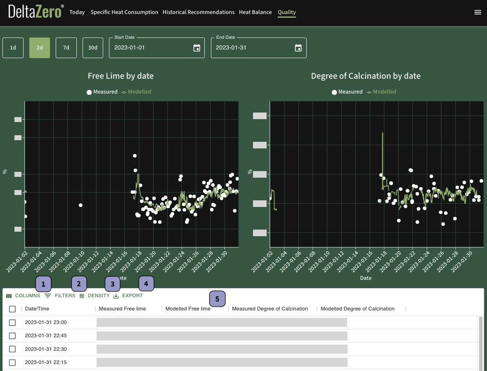

# Quality

The **Quality** data report charts the measured and modelled (predicted) values of Free Lime and Degree of Calcination (DoC).

**Measured** values are physical measurements obtained directly from lab data analyses of material samples.

**Modelled** values (also known as soft sensors) are predicted values between intervals of lab data (without implying we need lab data, i.e. 30d). These calculations are based on measured values (such as pressure, humidity, and time of day) as well as other plant data.

## Date Range

Change the date range of this report by selecting the calendar icon in **Start Date** and **End Date** (both dates inclusive).

Alternatively, select the corresponding button to apply the desired time period of the data (inclusive of today):

- **1d** – Past 1 day
- **2d** – Past 2 days (default)
- **7d** – Past 7 days
- **30d** – Past 30 days

## Data Table

The data table contains details of each recommendation, including the Status or outcome of the recommendation.

{{ label_1 }} **Columns**: Show or hide selected columns in the data table

{{ label_2 }} **Filters**: Narrow results by one column criteria. Additional filters cannot be added

{{ label_3 }} **Density**: Change row height in the data table

{{ label_4 }} **Export**: Print or download the data as a CSV file

{{ label_5 }} Click on the column name to sort the data by ascending or descending order