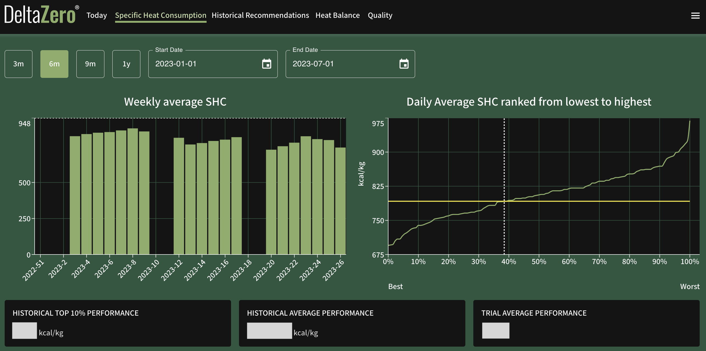

# Specific Heat Consumption

The **Specific Heat Consumption (SHC)** data report tracks the plant’s carbon emissions or specific heat consumption (kcal/kg) over time.

This report can be customised to your specific needs, such as setting the weekly average SHC to a daily cadence, or displaying the data as line graphs instead of bar graphs.

## Date Range

Change the date range of this report by selecting the calendar icon in **Start Date** and **End Date** (both dates inclusive).

Alternatively, select the corresponding button to apply the desired time period of the data (inclusive of today):

- **1m** – Past 1 month
- **3m** – Past 3 months
- **6m** – Past 6 months (default)
- **1y** – Past 1 year

## Data Export

There is no export feature on this page. You may contact us at {{ support }} to request a copy of this data.
