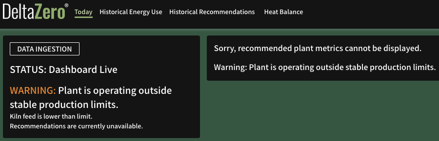
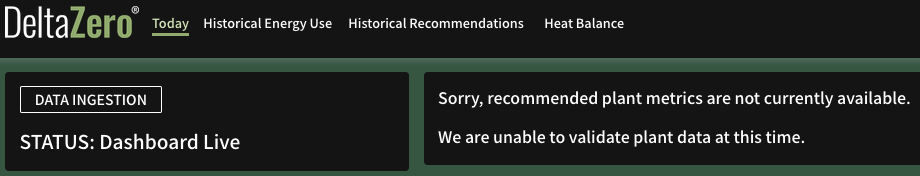

If there are issues with the data ingestion or a new recommendation failed to generate, the Current Recommendation widget is replaced by one of the following messages:

### ​Sorry, recommended plant metrics cannot be displayed.

To resolve, check the Warning message in the [Data Ingestion](data_ingestion.md) widget, and perform the action required for [Dashboard Live – Warning](data_ingestion.md#🟠-dashboard-live-–-warning) or [Dashboard not live!](data_ingestion.md#🔴-dashboard-not-live) accordingly.

### Sorry, recommended plant metrics are not currently available.  We are unable to validate plant data at this time.

Despite successful data ingestion, the recommendation engine failed to generate a new set of recommended plant metrics. To resolve, please contact us at {{ support }}.