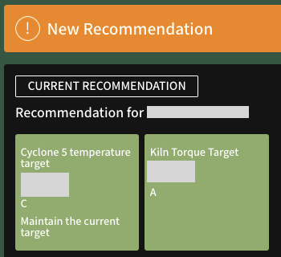

{ .img-left .img-smaller }

A **recommendation** is a set of suggested changes to the recommendable metrics (plant parameters shown in light green) that are forecasted to reduce carbon emissions & fuel costs.

A new recommendation is generated every 2 hours, alerting the user with a sound and notification banner that disappears after 30 minutes.

 
 
 
 

## Parameter States

The state of each recommendable metric is highlighted in the following colours:

- Green (minor change): Recommended change is a minor adjustment compared to the current metric (shown in [Lab Data](lab_data.md) or [Sensor Data](sensor_data.md)).

- Amber (major change): Recommended change is a major adjustment compared to the current metric (shown in [Lab Data](lab_data.md) or [Sensor Data](sensor_data.md)).   

Each recommendation is subsequently recorded in [Historical Recommendations](historical_recommendations.md) (available to live plants only).