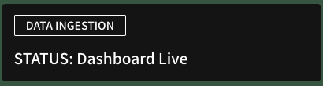
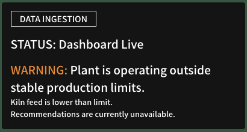
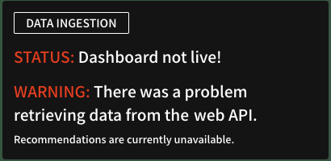

**Data Ingestion** tracks whether plant data is successfully synced (sent to Carbon Re servers) every 15 minutes as scheduled.

The **Status** updates if the data received is lower or higher than expected metrics, or is not being synced at all. 

!!! bug "Issues"
    See [Common Issues](common_issues.md) if there are issues with the data ingestion or a new recommendation failed to generate.

There are 3 statuses demonstrating the state of the data flow: 

## 🟢 Dashboard Live

{ .img-right .img-smaller }

**Description:** Live data received.

**Outcome:** Recommendations generated.

**Action:** Review [Current Recommendation](current_recommendation.md).

## 🟠 Dashboard Live – WARNING

{ .img-right .img-smaller }

**Description:** Plant is operating below or above standard operational limits as defined below the warning message.

**Outcome:** No recommendations, predictions, operator review & feedback displayed.

**Action:** No action required.

## 🔴 Dashboard not live!

{ .img-right .img-smaller }

**Description:**  Live data has not been received for over 15 minutes.

**Outcome:** Current plant data is not available (N/A). No recommendations, predictions, operator review & feedback displayed.

**Action:** Consult your data engineering team. If applicable, note the **Latest Data Received** and contact us at {{ support }}.

 

For more information on your plant’s data flows, please refer to [Data Access Requirements](data-access-requirements.md).