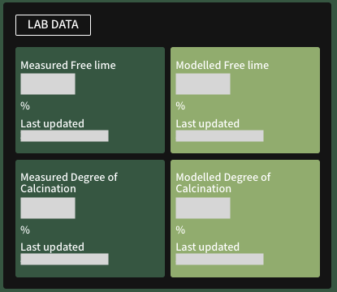

{ .img-left .img-smaller }

**Lab data** displays both measured and modelled key metrics for free lime and degree of calcination (in percentages). 

Measured parameters are pulled directly from plant data.

Modelled (predicted) parameters are calculated approximately every 15 minutes, based on the measured values.

 
 
 

## Parameter States
The state of each parameter is highlighted in the following colours:

- {{ parameter_amber }}: The value of this parameter is out of bounds, or is not current (synced 2 or more hours ago).

- {{ parameter_lightGreen }}

- {{ parameter_green }}
    
    The result of the change is predicted in the modelled value adjacent to the tile.

- {{ parameter_black }}