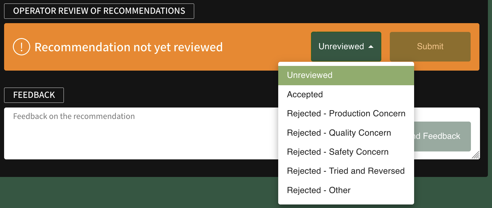

# Operator Review of Recommendations & Feedback

Delta Zero generates a new, unreviewed recommendation every 2 hours. The plant operator on duty is responsible for evaluating each of these suggested changes, confirming whether they have been implemented, and validating the prediction(s) or result(s) of the proposed changes.

!!! success "Your feedback is important"
    The operator’s review & feedback are vital for continuous improvement. Our Machine Learning models rely on feedback to generate better recommendations to further reduce your carbon emissions and fuel costs.

1. Review the [Current Recommendation](current_recommendation.md)

2. Select **Unreviewed** from the dropdown menu, and choose one of the following options:

    !!! tip inline end 
        If two or more options are applicable, select the option with the highest impact and indicate the other in your feedback.
        
        For example, if you believe the current recommendation will result in lower, but acceptable, levels of production at lower quality, select *Rejected - Quality Concern* and indicate both outcomes in the feedback.

    - **Unreviewed**: The recommendation has not been reviewed.
    
    - **Accepted**: The recommended change(s) have been implemented.
    
    - **Rejected - Production Concern**: The recommended change(s) have not been implemented because the amount of production may be reduced or result in a level that is not sustainable.
    
    - **Rejected - Quality Concern**: The recommended change(s) have not been implemented because the quality of production may decline.
    
    - **Rejected - Safety Concern**: The recommended change(s) have not been implemented for safety reasons.
    
    - **Rejected - Tried and Reversed**: The recommended change(s) have been implemented, however they were later reversed to previous settings.
    
    - **Rejected - Other**: The recommended change(s) have not been implemented for none of the reasons listed above. Please submit feedback for further details.

        

3. **Submit** your review. You may send a new review after the first submission, although the Unreviewed option can no longer be selected.

## Feedback

(optional) **Send Feedback** on the recommendation. Provide as much detail as possible for the reason and/or outcome of the accepted or rejected recommendation.

These comments are sent to the Product team at Carbon Re. You may request a copy of past feedback by contacting us at {{ support }}.