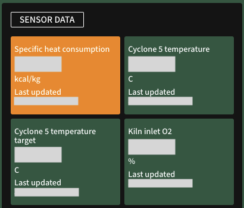

{ .img-left .img-smaller }

**Sensor data** displays key plant metrics (parameters), with the date & time of the last sync recorded in their respective **Last updated** timestamp.

Every plant has their own custom list of key parameters, however all plants display the following:

- Fan Speed
- Kiln Feed
- Specific heat consumption

To add or modify parameters, please contact us at {{ support }}.

## Parameter States
The state of each parameter is highlighted in the following colours:

- {{ parameter_amber }}: Data for this parameter is not current (synced 2 or more hours ago).

- {{ parameter_lightGreen }}

- {{ parameter_green }}
    
    Depending on the metric, the result of the change is predicted (modelled) in [Lab Data](lab_data.md).

- {{ parameter_black }}