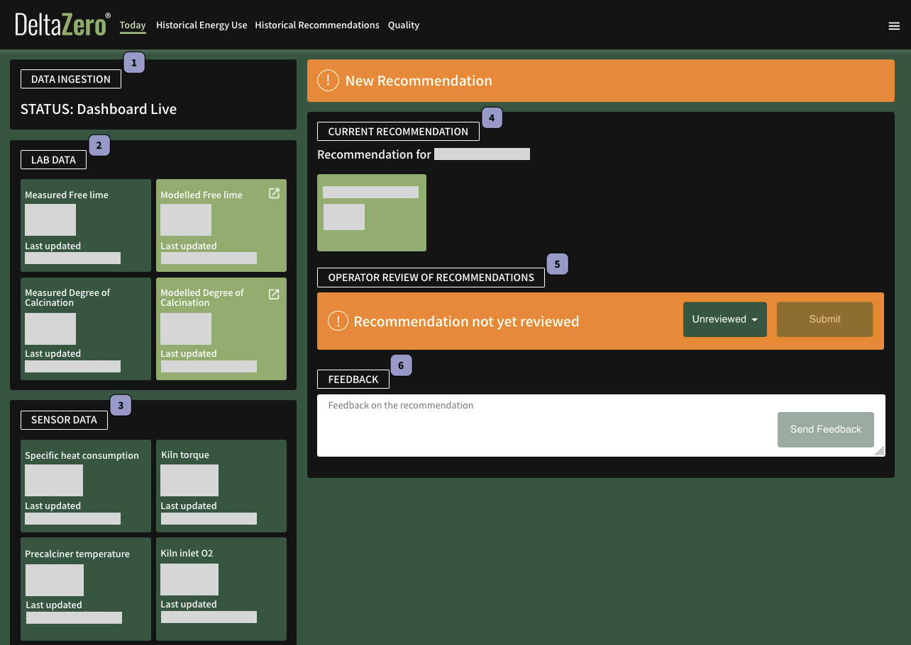

---
hide:
  - feedback
---

!!! bug "Issues"
    See [Common Issues](common_issues.md) if there are issues with the data ingestion or a new recommendation failed to generate.

Once logged in, Delta Zero opens to the **Today** page.

This is a dashboard summarising the state of current plant data, and the newest recommendation and predictions. 

Today is comprised of 6 widgets:

|   |   |
|---|---|
| {{ label_1 }} [DATA INGESTION](data_ingestion.md) | {{ label_4 }} [CURRENT RECOMMENDATION](current_recommendation.md) |
| {{ label_2 }} [LAB DATA](lab_data.md) | {{ label_5 }} [OPERATOR REVIEW OF RECOMMENDATIONS](operator_review.md) |
| {{ label_3 }} [SENSOR DATA](sensor_data.md) | {{ label_6 }} [FEEDBACK](operator_review.md) |