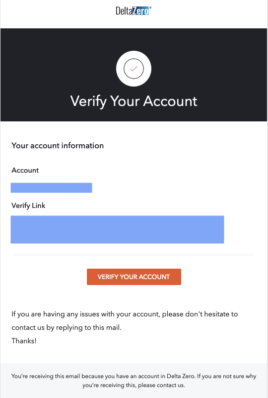

{ .img-right .img-smaller }

When a new user is created, the registered email address will receive an email from {{ support }} with the subject **Verify your email**.

This email contains a custom link to activate your login credentials. 

Select **Verify Link** or **VERIFY YOUR ACCOUNT** to enable your Delta Zero account.

!!! note 
    This link is valid for 5 days. If you need a new verification link, please contact us at {{ support }} to send you a new email.

Once verified, follow the instructions in [Password Reset](password-reset.md) to set your own password.