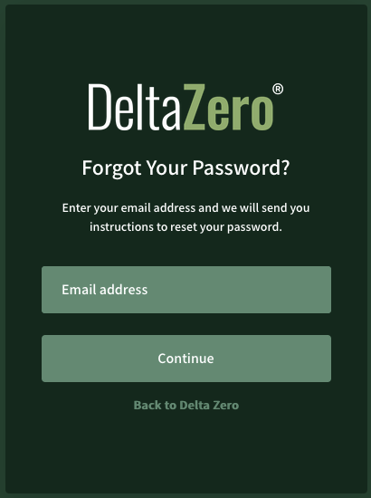
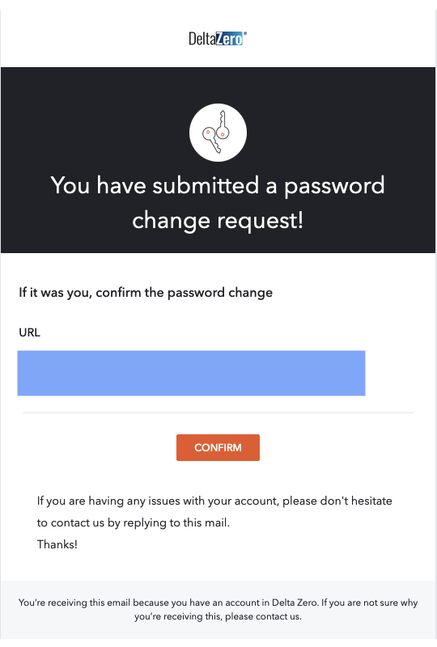
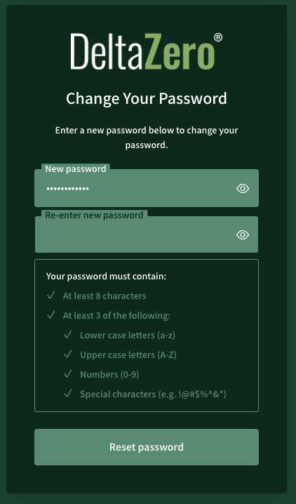
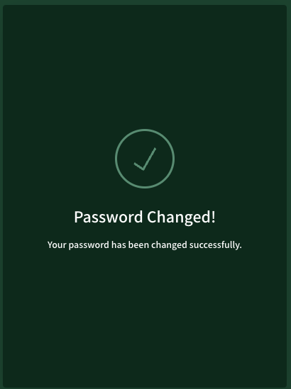

1. In the Login page, select **Forgot password?**

2. Enter your email address, select **Continue**.

    { .img-smaller }

3. You will receive an email from {{ support }} with the subject **Reset your Password**. 
    
    This email contains a custom link to set up a new password.

    { .img-smaller }

4. Set a new password containing a minimum of 8 characters, with at least 3 of the following types of characters:
    - Lower case (a-z)
    - Upper case (A-Z)
    - Numbers (0-9)
    - Special characters (!@#$%^&*)

    { .img-smaller }

5. Confirm successful password reset.

    { .img-smaller }

For any issues or questions, please contact us at {{ support }}.